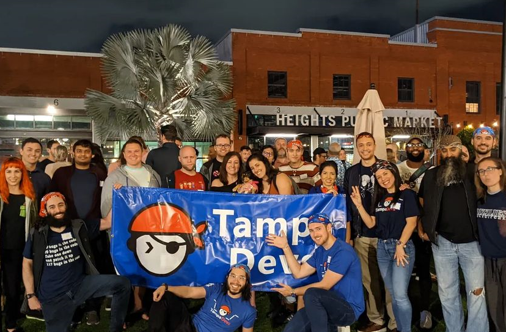

# Tommy Garvin

## About me

- My family & I take full advantage of living in [The Sunshine City](https://www.stpete.org/visitors/about_st_pete.php).
- I enjoy bicycling, theme parks, metal detecting, maritime hobbies, live music, museums, and mediterranean food.
- I have a passion for simplifying complex problems.

## Lifelong learner

I'm continually improving my skills in:

- Finance
- Piano
- Spanish

I'm active with the following programming languages:

<a href="https://isocpp.org/">
<a href="https://go.dev/">
<a href="https://www.python.org/">
<a href="https://www.rust-lang.org/">

## Connect with me

I'm passionate about my field of work and love to "talk shop" with colleagues.

- [tommygarvin.github.io](https://tommygarvin.github.io/)

## Organizations

I'm active in the following communities:

- [Tampa Devs](https://www.tampadevs.com/)
- [WSMR Florida's Classical Music Station](https://wsmr.org/)
- [Captains For Clean Water](https://captainsforcleanwater.org/)

